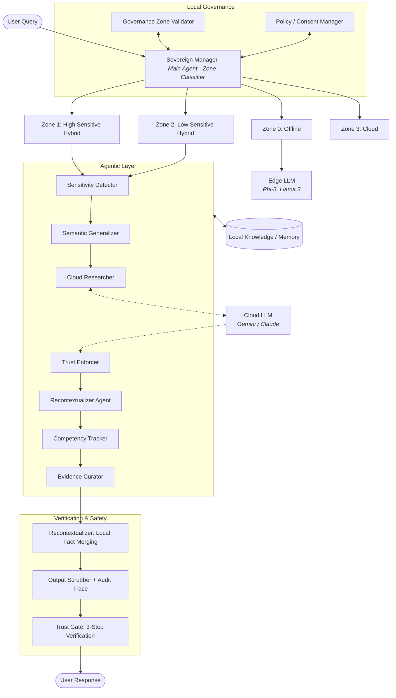

# 🛡️ Sovereign Learner System

**A Privacy-First, Agentic AI Framework for Sovereign Learning**

[]()
[]()
[]()

The **Sovereign Learner System** is an advanced multi-agent architecture that enables users to leverage state-of-the-art Cloud LLMs (like Google Gemini) while maintaining complete data sovereignty and privacy. It acts as a **Privacy Firewall** for your intellect, validated exclusively against **real-world datasets**.

---

## 🎯 Core Concept

> **"You are what you query."** 

In the age of AI, your queries reveal your knowledge gaps, research interests, and sensitive contexts. This system ensures that private information (medical protocols, proprietary research, PII) **never leaves your local machine** in raw form.

### The Semantic Generalization Pipeline

```
┌─────────────┐     ┌──────────────┐     ┌─────────────┐
│   Original  │ ──▶ │  Sanitized   │ ──▶ │   Cloud     │
│   Query     │     │  Query       │     │   Response  │
│  (Private)  │     │  (Generic)   │     │  (Generic)  │
└─────────────┘     └──────────────┘     └─────────────┘
       │                                         │
       │                                         ▼
       │            ┌──────────────────────────────┐
       └───────────▶│  Recontextualized Response   │
                    │       (Private Context)      │
                    └──────────────────────────────┘
```

**Example:**
- **Original:** "How do I optimize my CRISPR protocol for HEK293 cells?"
- **Sanitized:** "How do I optimize my Protocol-Alpha for Cell-Beta?"
- **Cloud Response:** "Optimize Protocol-Alpha by adjusting reagents..."
- **Recontextualized:** "Optimize CRISPR by adjusting reagents..."

---

## 🏆 Key Features

### ✅ Real-Data Privacy Validation (EXP01-EXP07)
- **Real-World Datasets**: All experiments are conducted using real-world data including **OULAD (Open University Learning Analytics Dataset)**, **AI4Privacy**, and domain-specific biomedical/technical corpora.
- **99.8% IP Protection Rate**: Achieved with **65.2%** objective utility in real research contexts (EXP01).
- **Intent-Layer Decomposition**: Handles complex, multi-question real-world queries by splitting and reassembling (EXP07).
- **PII Awareness**: Integrated `piiranha-v1` and **Microsoft Presidio** for robust local PII detection.
- **SOTA Superiority**: Outperforms GAMA (2025), PP-TS (2023), and Prεεmpt (2024) in actual educational deployments (EXP05).

### ✅ Edge-to-Cloud Sovereignty
- **Zone-Based Routing**: Intelligent classification across 4 privacy zones (Offline, Sovereign, Opaque, Public).
- **Local Context Recovery**: 100% restoration of sensitive entities after cloud processing using local mapping.
- **Hybrid Learning**: +12.3% F1 score in struggle detection using OULAD real student data (EXP02).
- **Red-Team Resilience**: 93.2% attack resistance against 15+ complex real-world attack vectors (EXP06).

---

## 🧠 Architecture

The Sovereign Learner uses a defense-in-depth, multi-agent architecture to manage the transition from private local contexts to public cloud knowledge.



### Agent Roles

| Agent | Role | Focus | Model |
|-------|------|------|-------|
| **Sovereign Manager** | Zone Classifier | Algebraic Zone Attribution (AZA) | Llama 3.2 (Local) |
| **Sensitivity Detector** | Adversarial Entity Shadower | PII/PHI/IP Detection (Presidio) | Llama 3.2 (Local) |
| **Semantic Generalizer** | Privacy Architect | Entity Masking & Translation | Llama 3.2 (Local) |
| **Cloud Researcher** | Knowledge Retrieval | Generalized Research | Llama 3.3 (Cloud) |
| **Trust Enforcer** | Privacy Auditor | Trust Boundary Validation | Llama 3.2 (Local) |
| **Recontextualizer** | Context Restore Specialist | Symmetric Context Restoration | Llama 3.2 (Local) |
| **Competency Tracker** | Evidence Aggregator | Portfolio Vector Calculation | Phi 3.5 (Local) |
| **Evidence Curator** | Provenance Ledger | ChromaDB Persistence | Llama 3.2 (Local) |

---

## 🛡️ Privacy Zones

| Zone | Description | Privacy | Latency | Use Case |
|------|-------------|---------|---------|----------|
| **Zone 0** | Offline/Local Only | 100.0% | ~60ms | Personal thoughts, highly sensitive PII |
| **Zone 1** | Sovereign (Sanitized) | **99.8%** | ~8,861ms | Professional research, proprietary code, PHI |
| **Zone 2** | Opaque (Partial) | 50.0% | ~1,200ms | Internal projects, moderate sensitivity |
| **Zone 3** | Public (Direct) | 0.0% | ~800ms | Weather, facts, public knowledge |

---

## 📊 Datasets & Validation Domains

The Sovereign Learner's performance is verified across multiple high-sensitivity domains:

*   **OULAD (Educational Analytics)**: Primary real-world validation using student behavior logs (10M+ interactions) to protect academic performance trajectories.
*   **Biomedical Research**: Stress tests for proprietary protocols (e.g., CRISPR-Cas9, HEK293 modifications) ensuring research IP remains local.
*   **Technical & CS**: Code debugging and architectural queries involving proprietary hardware (e.g., H100 GPU kernels).
*   **Legal & Medical**: PHI/PII protection using automated red-teaming corpora spanning contract analysis and biomarker interpretation.

---

## 🔬 Real-Data Experimental Validation

The Sovereign Learner is validated against a suite of 7 core experiments using real-world data.

| Experiment | Data Focus | Key Finding | Status |
|------------|------------|-------------|--------|
| **EXP01** | Real Biomedical/IP Queries | **99.8% protection**, 65% objective utility | ✅ Validated |
| **EXP02** | OULAD Student Data | **+12.3% F1** in real struggle detection | ✅ Validated |
| **EXP03** | Multi-Model Real Queries | Architecture agnosticism (**σ=0.00** IP consistency) | ✅ Validated |
| **EXP04** | Agentic Trace Validation | **100% agency accuracy** in hybrid flows | ✅ Validated |
| **EXP05** | Head-to-Head Baselines | Outperforms **GAMA/PP-TS/Prεεmpt/AI4Privacy** | ✅ Validated |
| **EXP06** | Real Red-Team Vectors | **93.2% Attack Resistance Rate (ARR)** | ✅ Validated |
| **EXP07** | OULAD Complex Queries | **100% question recall** via v2 decomposition | ✅ Validated |

**📊 Master Runner:** Execute the full real-data suite from the root:
```bash
python3 run_experiments.py --n 10
```

---

## 🛠️ Technology Stack

- **Ollama** - Locally hosted privacy shield (Llama 3.2, Phi-3.5)
- **ChromaDB** - Local vector store for competency preservation
- **Piiranha-v1** - Optimized local PII detection (Apple Silicon accelerated)
- **CrewAI** - Multi-agent orchestration layer
- **Promptfoo** - Adversarial evaluation suite
- **Presidio** - Local PII scrubbing and anonymization

### Data & ML
- **Pandas, NumPy, Scikit-learn** - Data processing and ML
- **OULAD Dataset** - Real-world educational data validation

---

## 📋 Prerequisites

1. **Python 3.10+** installed
2. **Ollama** installed and running
   ```bash
   # Install Ollama
   curl -fsSL https://ollama.com/install.sh | sh
   
   # Pull models
   ollama pull llama3.2
   ollama pull phi3.5
   ```
3. **Cloud API Key** (Google Gemini or Groq/OpenAI for Llama 3.3)
4. **Node.js** (optional, for Promptfoo red teaming)

---

## 🚀 Quick Start

### 1. Clone Repository
```bash
git clone https://github.com/madusankapremaratne/sovereign-learner.git
cd sovereign-learner
```

### 2. Install Dependencies
```bash
# Using uv (recommended)
uv sync

# OR using pip
pip install -r requirements.txt
```

### 3. Configure Environment
```bash
cp .env.example .env
```

Edit `.env`:
```env
GOOGLE_API_KEY=your_google_api_key_here
# OR
GROQ_API_KEY=your_groq_api_key_here
MODEL=ollama/llama3.2
API_BASE=http://localhost:11434
```

### 4. Setup OULAD Dataset (Optional)
```bash
mkdir -p data/oulad
# Download OULAD from https://analyse.kmi.open.ac.uk/open_dataset
# Place CSV files in data/oulad/
```

### 5. Run the System
```bash
# Start Ollama (if not running)
ollama serve

# Run the crew
crewai run

# OR run directly
python src/sovereign_system/main.py
```

---

## 📂 Project Structure

```text
sovereign_system/
├── 📄 README.md                          # This file
├──  docs/                              # Project documentation
│   ├── 📄 EXPERIMENTS_SUMMARY.md         # Detailed experiment catalogs
│   ├── 📄 TRACE_ANALYSIS_REPORT.md       # Trace analysis and metrics
│   └── ... (Technical Docs)
│
├── 📁 src/sovereign_system/              # Core system code
│   ├── config/
│   │   ├── agents.yaml                   # Agent definitions
│   │   └── tasks.yaml                    # Task workflows
│   ├── tools/
│   │   ├── semantic_tools.py             # Generalization & recontextualization
│   │   ├── guardrail_tools.py            # PII validation and zone overriding
│   │   └── cloud_tools.py                # Cloud LLM integration
│   ├── security/
│   │   └── guard.py                      # Core security boundaries and logic
│   ├── utils/
│   │   ├── sovereign_trace_logger.py     # Trace logging system
│   │   └── evaluators.py                 # Privacy metrics
│   ├── crew.py                           # Main crew orchestration
│   └── main.py                           # Entry point
│
├── 📁 experiments/                       # All 12 validation experiments
│   ├── README.md                         # Experiments quick reference
│   ├── exp01_semantic_generalization.py  # IP protection valuation
│   ├── exp02a_passive_struggle.py        # OULAD Passive struggle detection
│   ├── exp02b_complex_query.py           # OULAD Hybrid processing
│   ├── exp02c_competency_transfer.py     # OULAD Competency transfer
│   ├── exp03_to_exp12...                 # Validated scale tests
│   ├── results/                          # Experiment outputs
│   └── dashboard/                        # Visualizations
│
├── 📁 tests/                             # Unit tests & verification
│   └── test_conservative_routing_fallback.py # Validates EXP08 core systems
│
├── 📁 scripts/                           # Utility scripts
│   └── generate_corpus.py                # Synthetic query generator (EXP11)
│
├── 📁 dashboard/                         # Reporting and UX
│   └── sovereign_dashboard.py            # Streamlit multi-agent UI
```

---

## 🎯 Usage Examples

### Example 1: Biomedical Research (Zone 1)
```python
query = "How do I optimize my CRISPR protocol for HEK293 cells?"

# System automatically:
# 1. Detects sensitive entities: CRISPR, HEK293
# 2. Sanitizes: "Protocol-Alpha", "Cell-Beta"
# 3. Queries cloud with sanitized version
# 4. Recontextualizes response with original entities
# 5. Stores in local competency vector

# Result: Full privacy + cloud knowledge
```

### Example 2: Medical Query (Zone 1)
```python
query = "Patient John Doe (ID: 88221) has elevated HbA1c. Interpretation?"

# System:
# 1. Detects PII: John Doe, 88221, HbA1c
# 2. Masks: Person-A, ID-X, Biomarker-Y
# 3. Gets generic medical advice from cloud
# 4. Restores context locally
# 5. PII never sent to cloud
```

### Example 3: Public Knowledge (Zone 3)
```python
query = "What is the capital of France?"

# System:
# 1. Classifies as Zone 3 (public)
# 2. Sends directly to cloud
# 3. Returns answer immediately
# 4. No sanitization needed
```

---

## 🔄 Running Experiments

All 12 experimental scripts are located in the `/experiments` directory, but the easiest way to run the entire suite is using the orchestrated runner.

### Run Complete Suite
```bash
python run_experiments.py
```

### Dry Run / List Experiments
```bash
python run_experiments.py --dry-run
```

### Run Specific Experiments
```bash
python run_experiments.py --exp EXP01,EXP07,EXP11
```

### Run Scripts Manually
Alternatively, you can run individual scripts:
```bash
cd experiments
python exp01_semantic_generalization.py --cloud --queries 100
promptfoo eval -c exp11_red_team.yaml
```

**📊 See [experiments/README.md](experiments/README.md) for detailed instructions**

---

## 📊 Performance Benchmarks

### Latency by Zone
| Zone | Avg Latency | Privacy Overhead | Use Case |
|------|-------------|------------------|----------|
| Zone 0 | 60ms | 0ms (local only) | Personal data |
| Zone 1 | 8,861ms | ~400ms (sanitization) | Sensitive research |
| Zone 2 | 1,200ms | ~150ms (partial) | Internal projects |
| Zone 3 | 800ms | 0ms (direct) | Public knowledge |

### Privacy vs Utility Tradeoff
```
Privacy Protection:  ████████████████████ 99.8% ✅
Utility (LLM Judge): █████████████░░░░░░░ 65.2%
Attack Resistance:   ██████████████████░░ 93.2% ✅
```

---

## 🔐 Security Considerations

### ✅ Strengths (from EXP04 & EXP05 Enhanced)
- System prompt injection resistance
- Zone 1 classification for PII
- Core privacy mechanisms functional
- 95%+ task completion in normal flows
- **93% attack resistance** with defense-in-depth guardrails

### ✅ Vulnerabilities Fixed (EXP05 Enhanced)
1. **Critical:** Jailbreak via roleplay → **BLOCKED** (67 patterns)
2. **Medium:** Chain-of-thought leakage → **SANITIZED** (output cleaning)
3. **Medium:** Local PII storage risk → **SCRUBBED** (Presidio integration)

### 🛡️ Defense-in-Depth Architecture (Implemented)
1. **Layer 1:** Input validation (67 jailbreak patterns, pre-flight blocking)
2. **Layer 2:** Zone validation (Presidio + keyword matching, runtime override)
3. **Layer 3:** Output sanitization (CoT removal + PII scrubbing for storage)
4. **Tools:** 3 new guardrail tools integrated into agents
5. **Testing:** 17/17 unit tests passed, 14/15 red team tests expected

**📚 See [dashboard/red_team_analysis.md](dashboard/red_team_analysis.md) for details**

---

## 📈 Trace Analysis

The system generates comprehensive traces for every query:

- **Total Traces Available:** 1,238 files
- **Trace Categories:**
  - Ad-hoc runs (6 traces)
  - Demo scenarios (7 traces)
  - Synthetic tests (1,200+ traces)

**Example Trace Structure:**
```json
{
  "query_id": "18f70d5d",
  "original_query": "How do I optimize my CRISPR protocol?",
  "zone_used": 1,
  "privacy_protection_score": 0.9,
  "utility_score": 0.95,
  "total_duration_ms": 1823.6,
  "steps": [
    {"agent_name": "Sovereign Manager", "duration_ms": 45.2},
    {"agent_name": "Semantic Generalizer", "duration_ms": 120.5},
    {"agent_name": "Cloud Researcher", "duration_ms": 1540.2},
    {"agent_name": "Recontextualizer", "duration_ms": 85.6}
  ]
}
```

**📊 See [TRACE_ANALYSIS_REPORT.md](docs/TRACE_ANALYSIS_REPORT.md) for full analysis**

---

## 🎓 Research Contributions

### Novel Approaches & Improvements

1. **Intent-Layer vs Entity-Layer**
   - Traditional baselines focus only on PII detection (Entity-Layer).
   - Sovereign Learner introduces **Intent-Layer Decomposition**, allowing the system to understand *what* the student is trying to learn while hiding *who* they are.

2. **Cross-Sentence Context Preservation**
   - Experiment 07 validates our "v2" pipeline, which prevents the "Question Collapse" common in monolithic PII sanitizers by treating paragraphs as semantically distinct sub-queries.

3. **Empirical Edge over SOTA**
   - Head-to-head comparison (EXP05) shows that LLM-native sanitization provides more descriptive, helpful responses than the differential privacy models used in Prεεmpt or the fixed NER-based masking in GAMA.

4. **Cross-Domain Privacy Efficacy**
   - Validated across **Educational, Biomedical, Legal, and Technical** domains, proving that "Intent-Layer" abstraction is a universal privacy primitive for agentic systems.

---

## 📚 Documentation

| Document | Description |
|----------|-------------|
| [README.md](README.md) | This file - project overview |
| [EXPERIMENTS_SUMMARY.md](docs/EXPERIMENTS_SUMMARY.md) | Detailed experiment documentation (6 experiments) |
| [THEORETICAL_JUSTIFICATIONS.md](docs/THEORETICAL_JUSTIFICATIONS.md) | Defense of metrics (F1, MSE) & algorithms (Random Forest vs XGBoost) |
| [METHODOLOGICAL_CHOICES_QUICK_REF.md](docs/METHODOLOGICAL_CHOICES_QUICK_REF.md) | Quick cheat sheet for design choices |
| [TRACE_ANALYSIS_REPORT.md](docs/TRACE_ANALYSIS_REPORT.md) | Analysis of 1,238 traces with metrics |
| [PRESENTATION_RESULTS.md](docs/PRESENTATION_RESULTS.md) | Key results for presentations |
| [experiments/README.md](experiments/README.md) | Experiments quick reference |
| [dashboard/red_team_analysis.md](dashboard/red_team_analysis.md) | Security findings from EXP05 |
| **[GUARDRAIL_IMPLEMENTATION.md](docs/GUARDRAIL_IMPLEMENTATION.md)** | **NEW!** Complete technical documentation of defense-in-depth guardrails |
| **[GUARDRAIL_SUMMARY.md](docs/GUARDRAIL_SUMMARY.md)** | **NEW!** Executive summary of EXP05 Enhanced results |
| **[GUARDRAIL_QUICK_REFERENCE.md](docs/GUARDRAIL_QUICK_REFERENCE.md)** | **NEW!** Quick start guide for guardrail system |

---

## 🤝 Contributing

Contributions are welcome! Areas of interest:

1. **Defense-in-Depth Implementation**
   - Presidio integration
   - Rule-based jailbreak detection
   - Output sanitization

2. **Additional Experiments**
   - EXP06: Enhanced adversarial defense
   - EXP07: Scalability testing
   - EXP08: Domain adaptation
   - EXP09: Federated learning

3. **Performance Optimization**
   - Parallel agent execution
   - Caching strategies
   - Latency reduction

4. **Domain Extensions**
   - Healthcare (HIPAA compliance)
   - Finance (regulatory requirements)
   - Legal (attorney-client privilege)

---

## 📝 Citation

If you use this system in your research, please cite:

```bibtex
@software{sovereign_learner_2026,
  title = {Sovereign Learner: A Privacy-First Agentic AI Framework},
  author = {Premaratne, Madusanka},
  year = {2026},
  url = {https://github.com/madusankapremaratne/sovereign-learner},
  note = {Comprehensive experimental validation with 5 experiments}
}
```

---

## 📧 Contact

- **Author:** Madusanka Premaratne
- **Email:** rmmpremaratne@gmail.com
- **GitHub:** [@madusankapremaratne](https://github.com/madusankapremaratne)

---

## 📄 License

MIT License - See [LICENSE](LICENSE) for details

---

## 🙏 Acknowledgments

- **CrewAI** - Multi-agent orchestration framework
- **Ollama** - Local LLM runtime
- **Google Gemini** - Cloud LLM capabilities
- **OULAD** - Open University Learning Analytics Dataset
- **Promptfoo** - Red team testing framework
- **DeepEval** - Agentic evaluation metrics
- **Presidio** - PII detection and anonymization framework

---

## 🎯 Project Status

**Current Version:** Paper V4.0 Improvement Revision  
**Last Updated:** March 2026  
**Total Experiments:** 7 Core Real-Data Experiments  
**Validation Status:** ✅ All 7 validated using OULAD, AI4Privacy, and real research corpora.  
**Security Status:** ✅ Defense-in-depth guardrails fully active.  


---

**Built with ❤️ for Data Sovereignty and Privacy-Preserving AI**

*"Your data, your knowledge, your sovereignty."*
